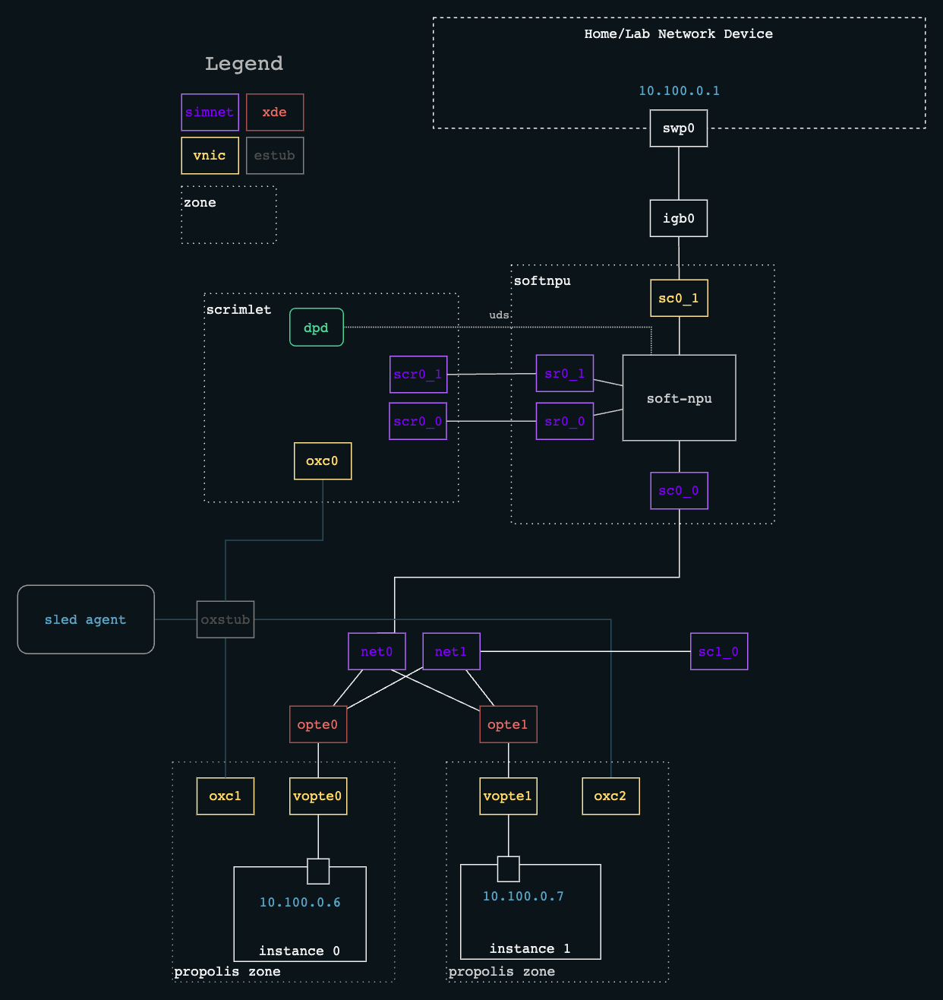

= Boundary Services A-Z

NOTE: The instructions for _deploying_ SoftNPU with Omicron have been folded
into xref:how-to-run.adoc[the main how-to-run docs].

The virtual hardware making up SoftNPU is depicted in the diagram below.

The `softnpu` zone will be configured and launched during
`cargo xtask virtual-hardware create`.

Once the control plane is running, `softnpu` can be configured via `dendrite`
using the `swadm` binary located in the `oxz_switch` zone. This is not necessary
under normal operation, as the switch state will be managed automatically by the
control plane and networking daemons.
