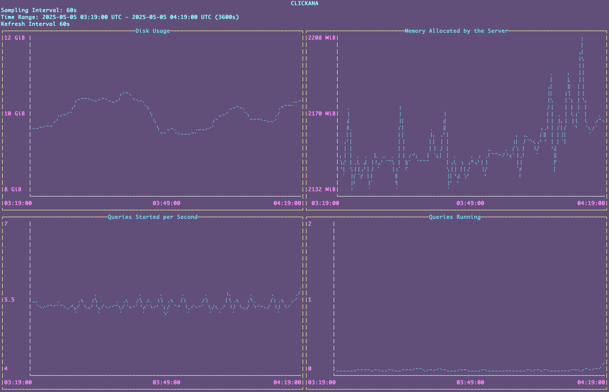

:showtitle:
:numbered:
:toc: left

= Omicron Clickhouse Debugging Guide

This is a guide for debugging Clickhouse on a variety of environments.

If you have advice that is not covered here, consider adding it!

== Debugging on a Live System

The following provides instructions for connecting to a Clickhouse shell on a running system.

. **Find the zone running Clickhouse**. This can be accomplished by running `zoneadm list -cv`. To connect to the single node installation find the zone with a prefix of `oxz_clickhouse`, to connect to a replicated cluster installation use one fo the zones with a prefix of `oxz_clickhouse_server`. If you're running on a multi-machine system (e.g., dogfood, colo, etc) and you have access to the `pilot` binary, you can ask all sleds at once for the location of Clickhouse with:
// '+' for list continuation to insert code blocks while keeping the list order
+
[source,bash]
----
# Run from the switch zone.
$ pilot host exec -c "zoneadm list -c | grep clickhouse" 0-31
----
. **Log into that zone**. This can be done using:
+
[source,bash]
----
# Run from the switch zone
$ pilot host login <cubby where clickhouse exists>

# Run from the machine with the Clichouse zone
$ pfexec zlogin oxz_clickhouse_<UUID>

# or for a replicated cluster

$ pfexec zlogin oxz_clickhouse_server<UUID>
----

. **Identify the IP address of Clickhouse**. This is possible using `ipadm`:
+
[source,bash]
----
# Run from within the Clickhouse zone
$ ipadm
ADDROBJ           TYPE     STATE        ADDR
lo0/v4            static   ok           127.0.0.1/8
lo0/v6            static   ok           ::1/128
oxControlService8/ll addrconf ok        fe80::8:20ff:fe35:6b0a%oxControlService8/10
oxControlService8/omicron6 static ok    fd00:1122:3344:107::4/64   <-- It's this one!
----
. **Log into Clickhouse using the CLI**
+
[source,bash]
----
# Run from within the Clickhouse zone
$ /opt/oxide/clickhouse/clickhouse client --host fd00:1122:3344:107::4
ClickHouse client version 22.8.9.1.
Connecting to fd00:1122:3344:107::4:9000 as user default.
Connected to ClickHouse server version 22.8.9 revision 54460.

oxz_clickhouse_aa646c82-c6d7-4d0c-8401-150130927759.local :)
----
. **Inspect the database**. At this point, you've successfully accessed the ClickHouse shell.
For replicated cluster installations, you may want to inspect the database in each of the replicas
to make sure data is being replicated.
The `oximeter` database is likely the most useful one for inspection:
+
[source,bash]
----
oxz_clickhouse_aa646c82-c6d7-4d0c-8401-150130927759.local :) USE oximeter;
oxz_clickhouse_aa646c82-c6d7-4d0c-8401-150130927759.local :) SHOW TABLES

SHOW TABLES

Query id: a8c82507-6179-40ee-8e51-4801ca5ff6f8

┌─name───────────────────────┐
│ fields_bool                │
│ fields_i16                 │
│ fields_i32                 │
│ fields_i64                 │
│ fields_i8                  │
│ fields_ipaddr              │
│ fields_string              │
│ fields_u16                 │
│ fields_u32                 │
│ fields_u64                 │
│ fields_u8                  │
│ fields_uuid                │
│ measurements_bool          │
│ measurements_bytes         │
│ measurements_cumulativef32 │
│ measurements_cumulativef64 │
│ measurements_cumulativei64 │
│ measurements_cumulativeu64 │
│ measurements_f32           │
│ measurements_f64           │
│ measurements_histogramf32  │
│ measurements_histogramf64  │
│ measurements_histogrami16  │
│ measurements_histogrami32  │
│ measurements_histogrami64  │
│ measurements_histogrami8   │
│ measurements_histogramu16  │
│ measurements_histogramu32  │
│ measurements_histogramu64  │
│ measurements_histogramu8   │
│ measurements_i16           │
│ measurements_i32           │
│ measurements_i64           │
│ measurements_i8            │
│ measurements_string        │
│ measurements_u16           │
│ measurements_u32           │
│ measurements_u64           │
│ measurements_u8            │
│ timeseries_schema          │
│ version                    │
└────────────────────────────┘
41 rows in set. Elapsed: 0.002 sec.
----
. **Query for your schema**. The `timeseries_schema` table can provide some additional context for your particular
measurement. The rest of this document will contain an example looking for a very specific "transaction retry"
timeseries, but you can substitute these values with your own. If we know even part of the timeseries name (like the word "transaction") we can search for it with the following:
+
[source,bash]
----
oxz_clickhouse_aa646c82-c6d7-4d0c-8401-150130927759.local :) SELECT timeseries_name,fields.type,fields.source,datum_type FROM timeseries_schema WHERE timeseries_name LIKE '%transaction%'

SELECT
    timeseries_name,
    fields.type,
    fields.source,
    datum_type
FROM timeseries_schema
WHERE timeseries_name LIKE '%transaction%'

Query id: 09e6086f-fc5d-4905-abed-013be55d6706

┌─timeseries_name─────────────────┬─fields.type──────┬─fields.source───────┬─datum_type─┐
│ database_transaction:retry_data │ ['U32','String'] │ ['Metric','Target'] │ F64        │
└─────────────────────────────────┴──────────────────┴─────────────────────┴────────────┘

1 row in set. Elapsed: 0.003 sec.
----
This tells us the following: first, our timeseries has fields (see: `fields.type`) from `fields_u32` and `fields_string`. Next, it also emits measurements (see: `datum_type`) into `measurements_f64`.

. **Query for your data**. This next step is extremely specific to your particular timeseries.
However, for this "database_transaction:retry_data" example, we need to query for data related
to this timeseries from `fields_u32`, `fields_string`, and `measurements_f64`. This information
should be inferable from the query to the `timeseries_schema` table.

+
[source,bash]
----
oxz_clickhouse_aa646c82-c6d7-4d0c-8401-150130927759.local :) SELECT
    fields_string.field_value as transaction_name,
    fields_u32.field_value as attempt,
    measurements_f64.datum as attempt_duration,
    measurements_f64.timestamp
FROM measurements_f64
INNER JOIN fields_string ON fields_string.timeseries_key = measurements_f64.timeseries_key
INNER JOIN fields_u32 ON fields_u32.timeseries_key = measurements_f64.timeseries_key
WHERE measurements_f64.timeseries_name = 'database_transaction:retry_data'
ORDER BY measurements_f64.timestamp ASC

Query id: 813c994e-058c-4af2-9d3a-11cf9f222cbf

┌─transaction_name─────────┬─attempt─┬─attempt_duration─┬────measurements_f64.timestamp─┐
│ sled_reservation_create  │       1 │      0.014977911 │ 2024-01-11 22:41:13.667101491 │
│ sled_reservation_create  │       1 │       0.01660099 │ 2024-01-11 22:41:13.667610290 │
│ sled_reservation_create  │       1 │      0.014088819 │ 2024-01-11 22:41:13.672007505 │
│ sled_reservation_create  │       1 │       0.01501511 │ 2024-01-11 22:41:13.673713738 │
│ sled_reservation_create  │       2 │      0.156134143 │ 2024-01-11 22:41:13.843218486 │
│ sled_reservation_create  │       2 │      0.150804944 │ 2024-01-11 22:41:13.855771487 │
│ sled_reservation_create  │       2 │       0.17012195 │ 2024-01-11 22:41:13.855798649 │
│ sled_reservation_create  │       1 │      0.205570224 │ 2024-01-11 22:41:13.872957153 │
│ sled_reservation_create  │       3 │      0.006690087 │ 2024-01-11 22:41:13.891856215 │
│ sled_reservation_create  │       4 │      0.012846307 │ 2024-01-11 22:41:13.955465361 │
│ sled_reservation_create  │       1 │      0.020482506 │ 2024-01-18 23:22:48.146559108 │
│ sled_reservation_create  │       1 │      0.008722631 │ 2024-01-19 05:26:07.397242186 │
│ sled_reservation_create  │       1 │      0.007484627 │ 2024-01-19 05:26:07.590876948 │
│ sled_reservation_create  │       1 │      0.008384388 │ 2024-01-19 05:27:42.833060701 │
│ sled_reservation_create  │       1 │      0.009016489 │ 2024-01-19 05:28:15.860577501 │
│ sled_reservation_create  │       1 │      0.017649607 │ 2024-01-29 08:21:59.599608552 │
│ sled_reservation_create  │       1 │      0.017026628 │ 2024-01-29 08:23:30.278820785 │
│ volume_create            │       1 │      0.025257548 │ 2024-01-29 13:03:44.799614376 │
│ volume_checkout          │       1 │      0.009869392 │ 2024-01-29 13:03:49.827578682 │
│ sled_reservation_create  │       1 │      0.018168935 │ 2024-01-29 13:03:56.876826535 │
│ volume_checkout          │       1 │      0.007425083 │ 2024-01-29 13:27:17.949365703 │
│ sled_reservation_create  │       1 │      0.017133937 │ 2024-01-29 13:27:39.534955222 │
│ sled_reservation_create  │       1 │      0.028159647 │ 2024-01-29 13:27:39.593375890 │
│ sled_reservation_create  │       1 │      0.053410541 │ 2024-01-29 13:27:39.593709195 │
│ sled_reservation_create  │       2 │      0.080795694 │ 2024-01-29 13:27:39.717689230 │
│ sled_reservation_create  │       1 │      0.071597836 │ 2024-01-29 13:27:39.722071303 │
│ regions_hard_delete      │       1 │      0.019350474 │ 2024-01-31 13:51:58.056808199 │
│ sled_reservation_create  │       1 │      0.032482692 │ 2024-02-01 06:41:51.647937599 │
│ volume_checkout          │       1 │      0.009380859 │ 2024-02-01 07:03:04.971258393 │
│ sled_reservation_create  │       1 │      0.018020138 │ 2024-02-01 07:04:17.110928203 │
│ regions_hard_delete      │       1 │      0.011993838 │ 2024-02-01 08:32:56.113587884 │
│ volume_checkout          │       1 │      0.223425122 │ 2024-02-01 15:47:31.240008185 │
│ volume_checkout          │       1 │      0.454675525 │ 2024-02-01 15:47:31.480408091 │
│ volume_checkout          │       1 │      0.445790132 │ 2024-02-01 15:47:31.480943824 │
│ volume_checkout          │       2 │      0.206526747 │ 2024-02-01 15:47:31.481037611 │
└──────────────────────────┴─────────┴──────────────────┴───────────────────────────────┘
----

. **Use Clickana for a quick overview of the system.** Within each of the `oxz_clickhouse_*` or `oxz_clickhouse_server_*`
zones you can find some basic dashboards with information about disk usage, memory allocation, queries started per second
and running queries. Connect using the same address you used previously, with the port `8888`.

+
[source,bash]
----
# Run from within the clickhouse or clickhouse_server zone
$ /opt/oxide/clickana/bin/clickana -a [fd00:1122:3344:107::4]8888

# Clickana has several settings to customise your dashboards
$ /opt/oxide/clickana/bin/clickana -h
Usage: clickana [OPTIONS] --clickhouse-addr <CLICKHOUSE_ADDR>

Options:
  -l, --log-path <LOG_PATH>                    Path to the log file [env: CLICKANA_LOG_PATH=] [default: /tmp/clickana.log]
  -a, --clickhouse-addr <CLICKHOUSE_ADDR>      Address where a clickhouse admin server is listening on
  -s, --sampling-interval <SAMPLING_INTERVAL>  The interval to collect monitoring data in seconds [default: 60]
  -t, --time-range <TIME_RANGE>                Range of time to collect monitoring data in seconds [default: 3600]
  -r, --refresh-interval <REFRESH_INTERVAL>    The interval at which the dashboards will refresh [default: 60]
  -h, --help                                   Print help

# You can exit the TUI by typing `q`
----

. **Check the status of the keepers.** In a replicated cluster, you'll also have several keeper zones that act as coordinator
nodes. To check each of their status you have several endpoints available through the clickhouse-admin API and the keeper client.
Like above, you can use `ipadm` to retrieve the keeper IP address.

+
[source,bash]
----

# Check the log indexes

root@oxz_clickhouse_keeper_b251c2b6:~# curl [fd00:1122:3344:103::23]:8888/4lw-lgif | jq
  % Total    % Received % Xferd  Average Speed   Time    Time     Time  Current
                                 Dload  Upload   Total   Spent    Left  Speed
100   236  100   236    0     0   2601      0 --:--:-- --:--:-- --:--:--  2622
{
  "first_log_idx": 100500001,
  "first_log_term": 100500001,
  "last_log_idx": 100630231,
  "last_log_term": 1,
  "last_committed_log_idx": 100630229,
  "leader_committed_log_idx": 100630229,
  "target_committed_log_idx": 100630229,
  "last_snapshot_idx": 100600000
}

# See the raft configuration

root@oxz_clickhouse_keeper_b251c2b6:~# curl [fd00:1122:3344:103::23]:8888/raft-config | jq
  % Total    % Received % Xferd  Average Speed   Time    Time     Time  Current
                                 Dload  Upload   Total   Spent    Left  Speed
100   595  100   595    0     0   6666      0 --:--:-- --:--:-- --:--:--  6685
{
  "keeper_servers": [
    {
      "server_id": 1,
      "host": {
        "ipv6": "fd00:1122:3344:101::23"
      },
      "raft_port": 9234,
      "server_type": "participant",
      "priority": 1
    },
    {
      "server_id": 2,
      "host": {
        "ipv6": "fd00:1122:3344:109::23"
      },
      "raft_port": 9234,
      "server_type": "participant",
      "priority": 1
    },
    {
      "server_id": 3,
      "host": {
        "ipv6": "fd00:1122:3344:106::25"
      },
      "raft_port": 9234,
      "server_type": "participant",
      "priority": 1
    },
    {
      "server_id": 4,
      "host": {
        "ipv6": "fd00:1122:3344:103::23"
      },
      "raft_port": 9234,
      "server_type": "participant",
      "priority": 1
    },
    {
      "server_id": 5,
      "host": {
        "ipv6": "fd00:1122:3344:105::23"
      },
      "raft_port": 9234,
      "server_type": "participant",
      "priority": 1
    }
  ]
}

# See the keeper configuration

root@oxz_clickhouse_keeper_b251c2b6:~# curl [fd00:1122:3344:103::23]:8888/4lw-conf | jq
  % Total    % Received % Xferd  Average Speed   Time    Time     Time  Current
                                 Dload  Upload   Total   Spent    Left  Speed
100  1153  100  1153    0     0  13639      0 --:--:-- --:--:-- --:--:-- 13564
{
  "server_id": 4,
  "enable_ipv6": true,
  "tcp_port": 9181,
  "four_letter_word_allow_list": "conf,cons,crst,envi,ruok,srst,srvr,stat,wchs,dirs,mntr,isro,rcvr,apiv,csnp,lgif,rqld,rclc,clrs,ftfl",
  "max_requests_batch_size": 100,
  "min_session_timeout_ms": 10000,
  "session_timeout_ms": 30000,
  "operation_timeout_ms": 10000,
  "dead_session_check_period_ms": 500,
  "heart_beat_interval_ms": 500,
  "election_timeout_lower_bound_ms": 1000,
  "election_timeout_upper_bound_ms": 2000,
  "reserved_log_items": 100000,
  "snapshot_distance": 100000,
  "auto_forwarding": true,
  "shutdown_timeout": 5000,
  "startup_timeout": 180000,
  "raft_logs_level": "trace",
  "snapshots_to_keep": 3,
  "rotate_log_storage_interval": 100000,
  "stale_log_gap": 10000,
  "fresh_log_gap": 200,
  "max_requests_batch_bytes_size": 102400,
  "max_request_queue_size": 100000,
  "max_requests_quick_batch_size": 100,
  "quorum_reads": false,
  "force_sync": true,
  "compress_logs": true,
  "compress_snapshots_with_zstd_format": true,
  "configuration_change_tries_count": 20,
  "raft_limits_reconnect_limit": 50,
  "log_storage_path": "/data/coordination/log",
  "log_storage_disk": "LocalLogDisk",
  "snapshot_storage_path": "/data/coordination/snapshots",
  "snapshot_storage_disk": "LocalSnapshotDisk"
}

# Use the keeper client to check the status of the queried keeper

root@oxz_clickhouse_keeper_b251c2b6:~# /opt/oxide/clickhouse_keeper/clickhouse keeper-client -h [fd00:1122:3344:103::23]
Connected to ZooKeeper at [fd00:1122:3344:103::23]:9181 with session_id 189495
Keeper feature flag FILTERED_LIST: enabled
Keeper feature flag MULTI_READ: enabled
Keeper feature flag CHECK_NOT_EXISTS: disabled
/ :) mntr
zk_version      v23.8.7.1-lts-077df679bed122ad45c8b105d8916ccfec85ae64
zk_avg_latency  0
zk_max_latency  6
zk_min_latency  0
zk_packets_received     88521
zk_packets_sent 50603
zk_num_alive_connections        1
zk_outstanding_requests 0
zk_server_state follower
zk_znode_count  44567
zk_watch_count  0
zk_ephemerals_count     123
zk_approximate_data_size        16940968
zk_key_arena_size       8384512
zk_latest_snapshot_size 0

----