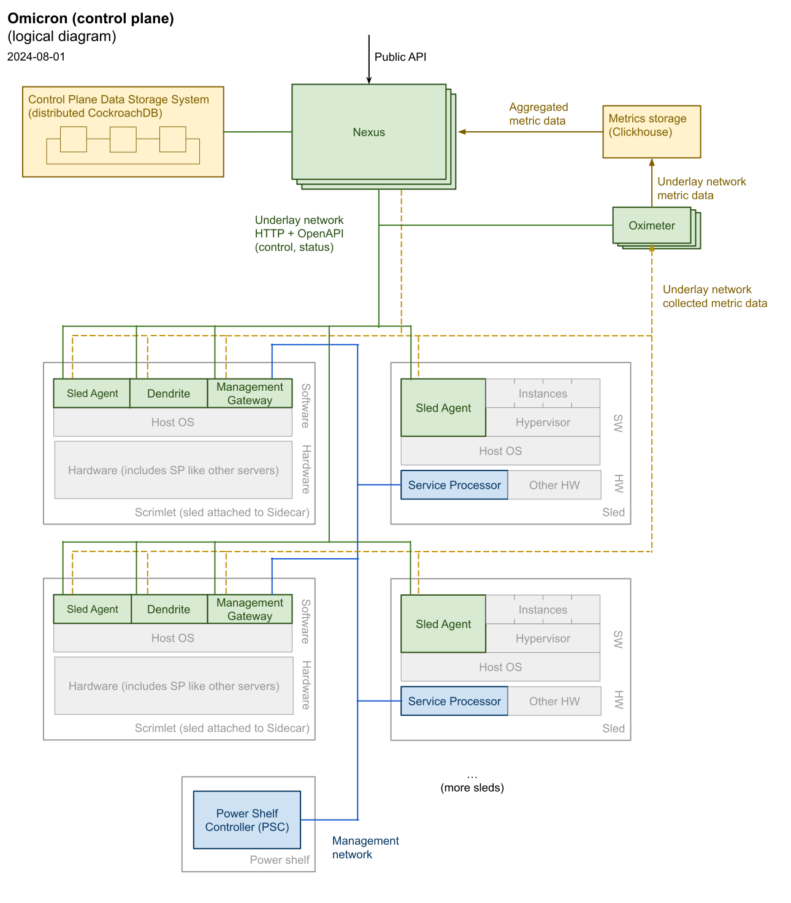

:showtitle:
:numbered:
:toc: left

//
// The sources for the diagrams in this document are in the Oxide Google Drive
// folder for Control Plane Architecture:
// https://drive.google.com/open?id=1OI-QxmapK7oYGFRGp0suJdpQDft-qVAz
//

= Control plane architecture

NOTE: Much of this material originally came from <<rfd48>> and <<rfd61>>.  This is now the living documentation for all the material covered here.

NOTE: The RFD references in this documentation may be Oxide-internal.  Where possible, we're trying to move relevant documentation from those RFDs into docs here.

See also: link:../notes/multicast-architecture.adoc[Multicast Architecture: VLAN Scope]

== What is the control plane

In software systems the terms **data plane** and **control plane** are often used to refer to the parts of the system that directly provide resources to users (the data plane) and the parts that support the configuration, control, monitoring, and operation of the system (the control plane).  Within the Oxide system, we say that the data plane comprises those parts that provide CPU resources (including both the host CPU and hypervisor software), storage resources, and network resources.  The control plane provides the APIs through which users provision, configure, and monitor these resources and the mechanisms through which these APIs are implemented.  Also part of the control plane are the APIs and facilities through which operators manage the system itself, including fault management, alerting, software updates for various components of the system, and so on.

Broadly, the control plane must provide:

* an externally-facing API endpoint described in <<rfd4>> through which users can provision elastic infrastructure backed by the system.  This includes APIs for compute instances, storage, networking, as well as supporting resources like organizations, users, groups, ssh keys, tags, and so on.  This API may be used by developers directly as well as the developer console backend.  See <<rfd30>>.
* an externally-facing API endpoint for all operator functions.  This is a long list, including configuration and management of hardware and software components and monitoring.
* implementation of lifecycle activities, like initial system setup; adding, removing, or replacing servers or other components; and the like.
* facilities for remote support by Oxide, including secure access to crash dumps, core files, log files, and system consoles.

== Fundamental properties

NOTE: These are design goals.  They have not all been fully implemented yet.

**Availability.**  Availability of the control plane refers to the property that requests to provision resources succeed when the underlying resources are available within the system and requests to reconfigure or monitor resources succeed as long as they are well-formed.  Unavailability refers to request failure due to hardware or software failure.

IMPORTANT: Generally, the control plane is expected to remain **available** in the face of any two hardware or software failures, including transient failures of individual compute sleds, power rectifiers, switches, or the like.

**Durability.**  Along the same lines, resources created in the control plane are expected to be durable unless otherwise specified.  That is, if the whole system is powered off and on again ("cold start"), the system should converge to a point where all instances, disks, and networking resources that were running before the power outage are available as they were from the user's perspective before the event.  Similarly, if a compute server is lost (either through graceful decommissioning or otherwise), it should be possible to resume service of resources that were running on that server (e.g., instances, disks) on other servers in the system.  There may be additional constraints on how many servers can fail permanently before data is lost, but in no case should it be possible to permanently lose an instance, disk, or other resource after the permanent failure of two compute sleds.

IMPORTANT: Resources created by users should generally survive permanent failure of any two hardware or software components.

**Consistency.**  Generally, users can expect strong consistency for resources within some namespace.  The bounds of the namespace for a particular resource may vary as described in <<rfd24>>.  For example, if a user creates an instance, another user with appropriate permissions should immediately see that instance.  In terms of https://en.wikipedia.org/wiki/CAP_theorem[**CAP**], the system is generally CP, with an emphasis on avoiding partitions through reliable software and hardware.

IMPORTANT: The API namespace is generally expected to provide strong consistency.

**Scalability and performance.**  The API is designed with a scheme for naming and pagination that supports operating on arbitrarily large collections, so in principle it's expected to support arbitrary numbers of most resources.  In practice, the system is intended to support on the order of 100 servers in a rack and 10,000 VMs in a rack.  While these numbers are unlikely to change drastically in the future, the long-term goal of providing a single view over multiple racks means the system will need to support much larger numbers of servers and other resources.  To avoid catastrophic degradation in performance (to the point of unavailability) as the system is scaled, aggressive limits will be imposed on the numbers of most resources.  Operators may choose to raise these limits but will be advised to test the system's performance at the new scale.

IMPORTANT: The API should support arbitrarily large systems.  The system itself should be clear about its target scale and avoid catastrophic degradation due to users consuming too many resources.

**Security.**  Older versions of <<rfd6>> discussed control plane security in great detail.  That content needs to be extracted from the history and probably put here.

**Supportability and debuggability.**  Effective customer support includes rapidly diagnosing issues and releasing fixes with low-risk updates.  To achieve this, all the software in the system, including the control plane, must be built with supportability in mind, which means being able to collect enough information about failures to diagnose them from their first occurrence in the field as much as possible and being able to update software with low risk to the system.  Details will be covered in an RFD to-be-named-later.

== Parts of the control plane

=== Crash course on hardware architecture

For our purposes, an Oxide rack comprises three types of boards (systems):

* Up to 32 compute **sleds** (servers).  These are sometimes called **Gimlets**, though "Gimlet" technically refers to a particular hardware generation.  Within the sled, the **host system** is the x86 box we generally think of as "the server".
* 1 or 2 **switches**, each attached via PCIe to one of the 32 compute sleds.  (The switches are _also_ connected to each of the 32 sleds for networking.  This PCIe connection we're talking about is for control of the switch itself, which is only done by one sled.)  The chassis that house the switches are sometimes called **Sidecars**, though "Sidecar" technically refers to a particular hardware generation.  Sleds that are attached to switches are often called **Scrimlets** (which is a little unfortunate since the name obviously comes from "Gimlet", but it might not be a Gimlet (since Gimlet refers to a specific hardware generation)).
* 1-2 power shelves, each with a **Power Shelf Controller (PSC)** that provides basic monitoring and control for the rectifiers that make up the power shelf.

Each type of system (Gimlet, Sidecar, and PSC) contains a **service processor** (SP) that's responsible for basic monitoring and control, typically including power control and thermal management.

<<rfd210>> discusses service processors in more detail.

=== Components that run alongside specific hardware

.Overview of the control plane

At the "bottom" of the stack, we have a few basic components that reside alongside the specific pieces of hardware that they manage:

* On each sled, the **sled agent** manages instances, storage, networking, and the sled's other resources.  Sled agent also collects information about hardware and reports it to Nexus.  Each sled also runs either a **boundary NTP** or **internal NTP** service to synchronize the sled's clock.  More on boundary NTP below.
* On the two Scrimlets, a "switch zone" provides additional functionality related to the switch:
** **Dendrite** provides APIs for configuring the switch itself (e.g., populating various tables used for packet forwarding, NAT, etc.).  
** **Management Gateway Service (MGS)** provides APIs for communicating with all the rack's service processors (including those on the sleds, Sidecars, and PSCs).  See <<rfd210>> for details.
** **Wicket** and its associated service **wicketd** provide a text user interface (TUI) that's accessible over the rack's technician ports.  Wicket is used for initial system setup (before networking has been configured) and for support.
** **Boundary NTP** provides NTP service for all sleds in the rack based on upstream NTP servers provided by the customer.

.Components deployed alongside specific hardware
[cols="1h,2,4",stripes="none",options="header"]
|===
| Component
| How it's deployed
| Availability/scalability

| Sled agent
| One per sled, tied to that specific sled
| N/A

| Internal NTP
| One zone per sled that doesn't have a Boundary NTP
| N/A

| Boundary NTP
| One zone on each of two sleds in the rack.  Both instances within a rack are fungible.
| There are two.  Short-term failure (order of hours or even days) is unlikely to affect anything since sled clocks do not drift that quickly.

| Dendrite
| Part of the switch zone (one per Scrimlet), tied to that specific switch
| Unavailability of either instance results in loss of ability to configure and monitor the corresponding switch.

| Management Gateway
| Part of the switch zone (one per Scrimlet)  Both instances within one rack are fungible.
| Only one of the two instances are generally required to maintain service.

| Wicket
| Part of the switch zone (one per Scrimlet).  Both instances within one rack are fungible.
| Wickets operate independently.  Failure of one means unavailability of the TUI over that technician port.

|===

=== Higher-level components

Most other components:

* are deployed in illumos zones
* don't care where they run and can even be deployed multiple times on the same sled
* can be deployed multiple times for availability, horizontal scalability, or both

They are:

* **Nexus** provides primary control for the whole control plane.  Nexus hosts all user-facing APIs (both operator and customer), the web console, and internal APIs for other control plane components to report inventory, generate alerts, and so on.  Nexus is also responsible for background control plane activity, including utilization management, server failure detection and recovery, and the like.  Persistent state is stored elsewhere (in CockroachDB), which allows Nexus to be scaled separately.
* **CockroachDB** provides a replicated, strongly-consistent, horizontally scalable database that stores virtually all control plane data.  See <<rfd53>> and <<rfd110>> for details.
* **Clickhouse** provides storage and querying services for metric data collected from all components in the rack.  See <<rfd125>> for more information.
* **Oximeter** collects metric data from the other components and store it into Clickhouse.  See <<rfd162>> for more information.
* **External DNS** operates authoritative DNS nameservers for end users and operators.  These are authoritative nameservers for whatever DNS name the customer specifies.  They currently just provide DNS names for the the external API and web console.
* **Internal DNS** provides DNS names for all control plane components.  This is how most of the control plane discovers its dependencies.  (See <<rfd206>> and <<rfd248>>.)

.Hardware-agnostic components
[cols="1h,2,4,4",stripes="none",options="header"]
|===
| Component
| How it's deployed
| Horizontal scalability
| Availability

| Nexus
| Using zones, as many as needed.  Instances are fungible.
| Not architecturally limited.  State provided by CockroachDB.
| With N instances needed to handle load, and M instances deployed, can survive M - N failures.

| CockroachDB
| Using zones, as many as needed.  Instances are fungible.
| Required, provided by CockroachDB cluster expansion.
| Required, provided by CockroachDB range replication.

| Clickhouse
| Using zones, as many as needed.  Instances are fungible.
| TBD
| Required, provided by Clickhouse replication (see <<rfd468>>).

| Oximeter
| Using zones, as many as needed.
| Yes.  Configuration managed by Nexus, stored in CockroachDB, and cached in local storage for improved availability when other components are down
| TBD.

| External DNS
| Using zones, as many as needed.  Instances are fungible.
| Not architecturally limited.  Generally limited by the number of external DNS server IP addresses provided by the customer, which is usually 2-5.
| Generally, only one is needed for service.

| Internal DNS
| Using zones, as many as needed.  Instances are fungible.
| Hardcoded limit of 5.
| With N instances needed to handle load, and M instances deployed, can survive M - N failures.

|===

== Design principles

=== Basics

As much as possible, components are deployed in illumos zones.  These are lightweight containers that act as their own complete systems (e.g., with their own dedicated networking stack with its own interfaces, IPs, etc.).

Oxide-produced components are written in Rust.  They communicate over HTTP using APIs managed via OpenAPI using Dropshot.  HTTP may not provide the best latency, but we don't expect the throughput of API requests to be so high or the target latency so low that the overhead of HTTP internally will noticeably impact the customer experience.  Using OpenAPI enables us to leverage investments in OpenAPI libraries, tooling, and documentation that we need for the external API.  Rigorous use of OpenAPI, including automatically generating OpenAPI specifications from server implementations, allows us to automatically identify potentially breaking API changes.  This information will eventually be included in metadata associated with each component's update images so that the upgrade software can use this to ensure that only compatible combinations of components are deployed.

Service discovery happens via DNS.  See <<rfd206>> and <<rfd248>>.

=== Nexus, data flow

Nexus is the place where system-wide decisions get made.  CockroachDB is the source of truth for all configuration.  

Nexus stores all of its state in CockroachDB.  It's the only component that communicates directly with CockroachDB.

Nexus instances operate independently, without directly coordinating with each other except through CockroachDB.

Generally, when a change gets made, the process is:

1. Nexus receives a request to make the change (e.g., via the external API)
2. Nexus validates the requested change
3. Nexus stores the information into CockroachDB.  (This is the point where change is serialized against any concurrent changes.)
4. Nexus propagates the change to other components that need to know about it.

There are a few basic contexts in Nexus:

* **API requests** from either the external or internal API.  Here, Nexus is latency-sensitive.  When we make database queries or other requests in this context, we usually do _not_ retry transient failures, but leave that to callers (See https://en.wikipedia.org/wiki/End-to-end_principle["end-to-end principle"]).  API request handlers may kick off sagas or activate background tasks.
* **Distributed sagas** are a https://www.youtube.com/watch?v=0UTOLRTwOX0[design pattern] for carrying out multi-step operations in a distributed system.  Saga actions generally _do_ retry transient errors indefinitely.
* **Background tasks** are periodic or event-triggered activities that manage everything else that has to happen in the system (e.g., change propagation, CockroachDB cluster management, fault tolerance, etc.).  Nexus has a framework for background tasks that's oriented around the "reconciler" pattern (see <<rfd373>>).  In this context, we also usually don't retry individual operations -- instead, the entire activity will be retried on a periodic basis.  Background tasks are structured to re-evaluate the state of the world each time they're run and then determine what to do, on the assumption that things may have changed since the last time they ran.

It's essential that components provide visibility into what they're doing for debugging and support.  Software should be able to exonerate itself when things are broken.

* API requests are short-lived.  The Nexus log is currently the only real way to see what these have done.
* Sagas are potentially long-lived.  Without needing any per-saga work, the saga log provides detailed information about which steps have run, which steps are in-progress, and the results of each step that completed.
* Background tasks are continuous processes.  They can provide whatever detailed status they want to, including things like: activity counters, error counters, ringbuffers of recent events, data produced by the task, etc.  These can be viewed with `omdb`.

=== Backwards Compatibility

==== Rules for data compatibility across versions (read this)

These rules are the most important things to focus on in terms of backwards compatibility, because they are the ad-hoc steps not covered by our infrastructure. Following these 2 rules should help make migrations safe and seamless, which will allow the production and test code to use the latest
version of the given data structures at all times.

1. Ensure the code to perfom an upgrade / backfill is in one location. This makes it easier to find and remove once it is no longer needed. It also makes it easier to test in isolation, and to understand the complete change.
2. When doing a migration from an old format to a new format, prefer to do it up front during some kind of startup operation so that the rest of the system can operate only in the new world. The system should not be trying to backfill
data during normal operation as this makes code have to support both the old and new formats simultaneously and creates more code bifurcation for testing.

==== Rationale and Background (read this if you care)

===== Network services

In general, backwards compatibility between services will be provided at the API level as described in <<rfd421>>. Most internal control plane service APIs are Dropshot based and therefore can utilize the same strategy. Some other services, such as trust quroum and Crucible, operate over TCP with custom protocols and have their own mechanisms for backwards compatibility. The introduction of new services of this type should be largely unnecessary for the foreseeable future.

===== Database state

While runtime compatibility between services is largely taken care of semantically, we still have to worry about compatibility of data on persistent storage. As a distributed system that cannot be atomically updated, a rack may have different versions of software running on different sleds with each sled containing persistent state in a slightly different format. Furthermore, the structure of this data may be different across different customer racks depending upon when they were first setup. We have various categories of persistent state. Some of it is stored in database management systems (DBMS), where schemas are concrete and well-defined. For these scenarios, we can rely on our schema migration strategy as defined in <<rfd527>>. After much discussion, this is largely a "solved" problem.

===== Ad-hoc persistent state

Slightly more concerning are things like serde serialized data types stored in JSON on various drives in the system. Most of these are stored in https://github.com/oxidecomputer/omicron/blob/5b865b74208ce0a11b8aec1bca12e2a6ea538bb6/common/src/ledger.rs#L48-L62[Ledgers] across both M.2 drives and are only read by the sled-agent. These ledgers are used to store things such as the initial rack plan, key shares for trust quorum, and networking (bootstore data) for early cold boot support. We have largely been dealing with these in an ad-hoc manner. In most cases, new code in sled-agent reads the old structure and writes the new version to disk on sled-agent startup. This largely works fine, but in some instances has caused problems during upgrade when this was not done properly. This seems to be a reliable strategy so far for this limited set of ledger data, and it is unlikely we will need to change it. We do have to carefully test our upgrade paths, but we should be doing that anyway, and our support on this front is being worked on currently. An additional concern is to remember to prune old version support once all customers are past the point of needing it. 

It is also important to note why the previous strategy works well and is largely foolproof. Each of these structures is coupled to a local process and only written and read by that process in a controlled manner. Format modifications are only made during update and are only visible locally. And most importantly, the code to perform those reads and writes is largely centralized in a single method, or at least single file per ledger. This makes it easy to reason about and unit test. 

===== Migration of state from sled-agent to nexus

Now we get to what has been the hairiest of the problems for data compatibility across versions. As we add more features, and make our system more consistent in its promise that Nexus manages state for the control plane instead of sled-agent, we have realized that Nexus sometimes doesn't have enough information to take over this responsibility. In such cases when performing https://github.com/oxidecomputer/omicron/blob/5b865b74208ce0a11b8aec1bca12e2a6ea538bb6/sled-agent/src/sim/server.rs#L254[RSS handoff to Nexus], we have had to add new state to the handoff message so that Nexus can create a blueprint to drive the rest of the system to its desired state via https://github.com/oxidecomputer/omicron/blob/main/docs/reconfigurator.adoc[Reconfigurator]. However, this only works for new rack deployments when we actually run RSS. For existing deployments that have already gone through initial rack setup, the new Nexus code does not have enough information to proceed with running reconfigurator. In this case we must **backfill** that information. This can, and has, been done a variety of ways. We sometimes may have to add new data to CRDB, and sometimes modify a schema and backfill columns. Othertimes, we may need to retrieve important data from sled-agent and store it in existing placeholders in blueprints. In any event, doing this is tricky and influences how legible the code is to read, how testable it is, and how correct it is under all circumstances. It's for this reason that we proposed the rules for data compatibility in the prior section, which largely align with how we do ledger updates.

For more on this, see the xref:reconfigurator.adoc#_incorporating_existing_configuration_into_reconfigurator[Reconfigurator docs on this subject].

== Cold start

"Cold start" refers to starting the control plane from a rack that's completely powered off.  Achieving this requires careful consideration of where configuration is stored and how configuration changes flow through the system.

We'll start from the point where sleds are powered on, even though a lot happens with the rectifiers, service processors, Sidecars, etc. before that point.  Once host systems are powered on:

* Sled agents start up, communicate with each other, and form a trust quorum that enables each of them to decrypt their local storage.  This local storage includes:
** a **bootstore** containing basic network configuration needed to bring up the rack
** information about what control plane services are running on this sled
* Sled agents apply any needed network configuration and start any services they're supposed to be running:
** On Scrimlets, the switch zone and boundary NTP are started.  Boundary NTP synchronizes time from the customer-provided NTP servers.
** On non-Scrimlets, internal DNS is started.  The rest of cold boot waits until time has been synchronized from the boundary NTP instances.
** Once time is synchronized, internal DNS services are started so that components can find each other.
** Once internal DNS is available, all other services are started concurrently.
*** CockroachDB nodes start up, discover the rest of the cluster via DNS, and form a cluster.
*** Nexus starts up and waits for CockroachDB to become available.
*** All other services start up and wait for their dependencies to become available.

For this to work:

* **Bootstore** must contain enough information to configure networking on the switches and each host to reach other services within the rack as well as the outside world (for NTP).
* **Internal DNS** must be able to come up without any external dependencies, meaning it stores a complete copy of all DNS data locally.

However, Nexus is the place where all _changes_ to configuration are made, and CockroachDB is the source of truth for all configuration.  As a result, when changing bootstore contents or internal DNS, the change is first made at Nexus, stored into CockroachDB, and then propagated to all sleds and internal DNS instances for local persistent storage so that it's available on cold start (of the _sled_) without the rest of the control plane being up.

This is a very rough approximation, but gives an idea of the dependencies associated with cold start.

[bibliography]
== References

Unfortunately, most of these RFDs are not yet public.

* [[[rfd4, RFD 4]]] https://rfd.shared.oxide.computer/rfd/4/[RFD 4 User Facing API]
* [[[rfd6, RFD 6]]] https://rfd.shared.oxide.computer/rfd/6/[RFD 6 Threat Model].  Note the reference above comes from an earlier version of RFD 6 (7e44771b239c0458aea2b6e2045294d41b79cb22 or earlier).
* [[[rfd24, RFD 24]]] https://rfd.shared.oxide.computer/rfd/24/[RFD 24 Multi-Rack Oxide Deployments]
* [[[rfd30, RFD 30]]] https://rfd.shared.oxide.computer/rfd/30/[RFD 30 Oxide Console Prototype]
* [[[rfd48, RFD 48]]] https://rfd.shared.oxide.computer/rfd/48/[RFD 48 Control Plane Requirements]
* [[[rfd53, RFD 53]]] https://rfd.shared.oxide.computer/rfd/53/[RFD 53 Control plane data storage requirements]
* [[[rfd61, RFD 61]]] https://rfd.shared.oxide.computer/rfd/61/[RFD 61 Control Plane Architecture and Design]
* [[[rfd110, RFD 110]]] https://rfd.shared.oxide.computer/rfd/110/[RFD 110 CockroachDB for the control plane database]
* [[[rfd125, RFD 125]]] https://rfd.shared.oxide.computer/rfd/125/[RFD 125 Telemetry requirements and building blocks]
* [[[rfd162, RFD 162]]] https://rfd.shared.oxide.computer/rfd/162/[RFD 162 Metrics collection architecture and design]
* [[[rfd206, RFD 206]]] https://rfd.shared.oxide.computer/rfd/206/[RFD 206 Service Discovery]
* [[[rfd210, RFD 210]]] https://rfd.shared.oxide.computer/rfd/210/[RFD 210 Omicron, service processors, and power shelf controllers]
* [[[rfd248, RFD 248]]] https://rfd.shared.oxide.computer/rfd/248/[RFD 248 Omicron service discovery: server side]
* [[[rfd373, RFD 373]]] https://rfd.shared.oxide.computer/rfd/373/[RFD 373 Reliable Persistent Workflows]
* [[[rfd421, RFD 421]]] https://rfd.shared.oxide.computer/rfd/0421[RFD 421 Using OpenAPI as a locus of update compatibility]
* [[[rfd468, RFD 468]]] https://rfd.shared.oxide.computer/rfd/468/[RFD 468 Rolling out replicated ClickHouse to new and existing racks]
* [[[rfd527, RFD 527]]] https://rfd.shared.oxide.computer/rfd/0527[RFD 527 Online database schema updates]
