:showtitle:
:toc: left
:icons: font

= Mixing MUPdate With Update

This document describes the mechanics of how MUPdate (<<rfd345>>) and Nexus-driven update interact with each other.

This document is structured as a walkthrough of an example MUPdate. For a more formal description of the motivation and rationale, see <<rfd556>>.

== Initial state

Under Nexus-driven update, the initial state of the system has zone and host phase 2 image sources set to `Artifact`.

[source,console]
----
root@oxz_switch1:~# omdb db inventory collections show latest
----

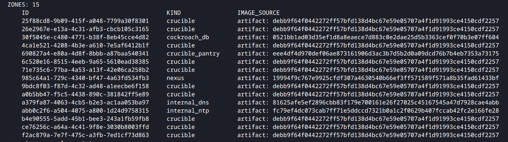

[source,console]
----
root@oxz_switch1:~# omdb nexus blueprints show target
----

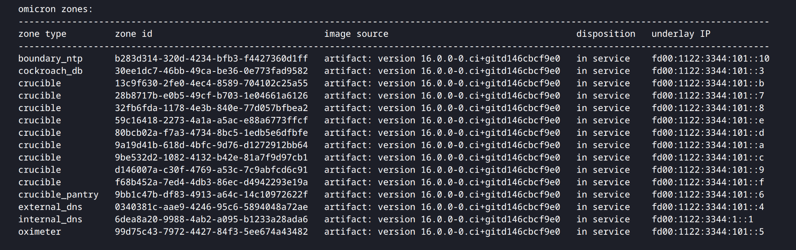

== Performing a MUPdate

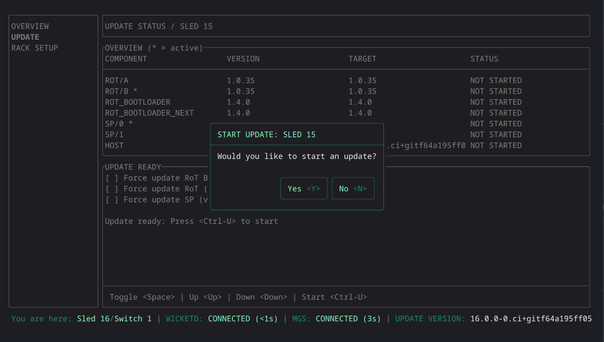

When a MUPdate is performed via Wicket, it:

* updates Hubris artifacts (SP/RoT etc)
* writes out the host phase 1 and phase 2 images
* writes out control plane zones to the install dataset

As part of MUPdate/update coordination, it also writes out to the install dataset:

* a _zone manifest_: a list of all the zones in the install dataset, along with their hashes
* a _mupdate override_ file: an indicator that a MUPdate happened recently.

After a MUPdate, the install dataset looks like this:

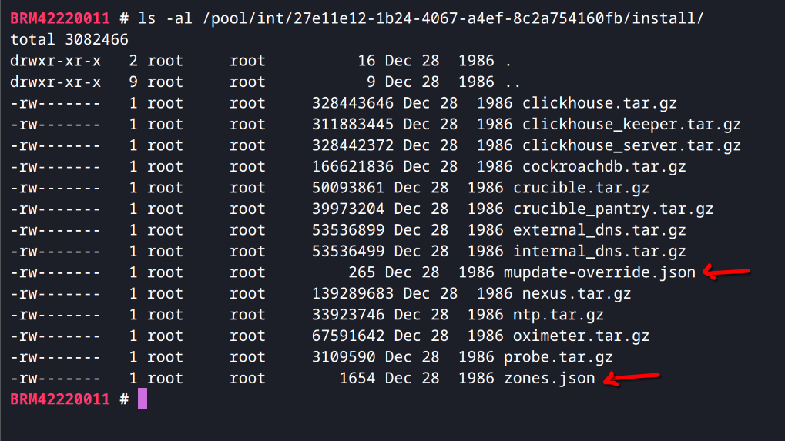

The zone manifest is a JSON file that contains zone names, file sizes, and SHA-256 hashes:

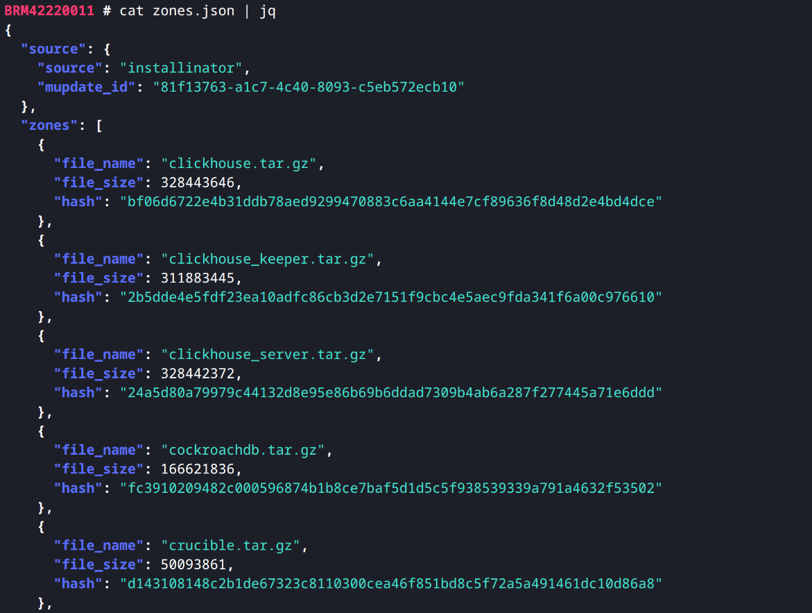

The mupdate override file contains, most importantly, a *mupdate override ID* (a UUID):

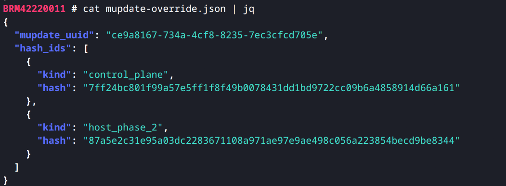

The mupdate override ID uniquely identifies a MUPdate on a particular sled. (When batch-MUPdating multiple sleds, each sled gets its own mupdate override ID.)

Why use a UUID rather than a simple marker file? If multiple MUPdates happen to a single sled, we'd like to treat them as separate events: if a sled is halfway to recovery and another MUPdate happens, we'd like to reset to the beginning.

== Detecting the MUPdate

Sled Agent reads the zone manifest at startup and validates all the zones, reporting them up to Nexus during the next inventory collection:

[source,console]
----
root@oxz_switch1:~# omdb db inventory collections show latest
----

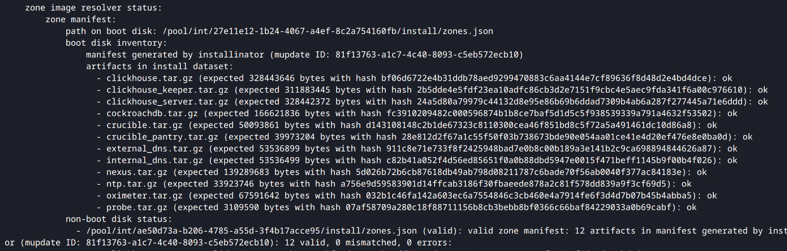

Also, if Sled Agent finds a mupdate override file, it does two things:

. Report this fact in the inventory:
+
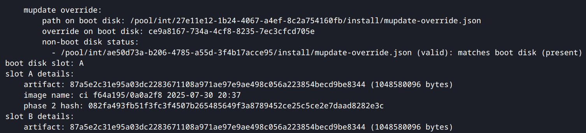

. _Redirect_ zone images to start from the install dataset, honoring the fact that an operator did a MUPdate:
+
[source,console]
----
BRM42220011 # looker -f $(svcs -L sled-agent) -C | less -FRX
----
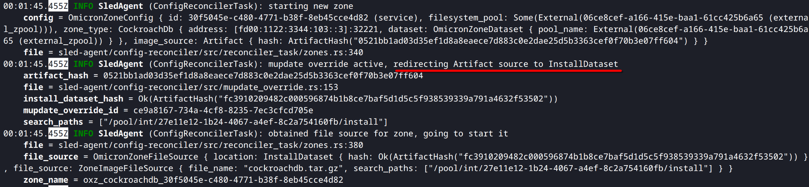

== Honoring the MUPdate

The Reconfigurator planner, on seeing a mupdate override file in the inventory, generates a new blueprint that acknowledges the MUPdate. This consists of four changes:

[source,console]
----
root@oxz_switch1:~# omdb nexus blueprints diff latest
----

. The "will remove mupdate override" field is set for that sled:
+
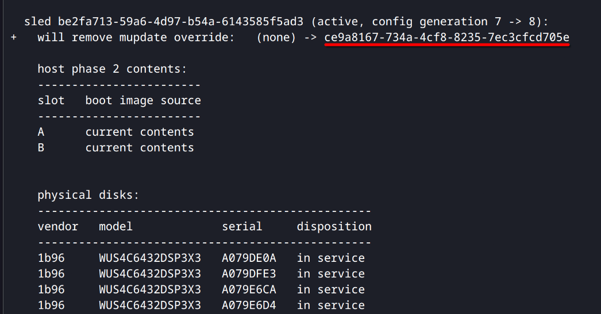

. All zone image sources are set to the install dataset, reflecting the redirection that Sled Agent did:
+
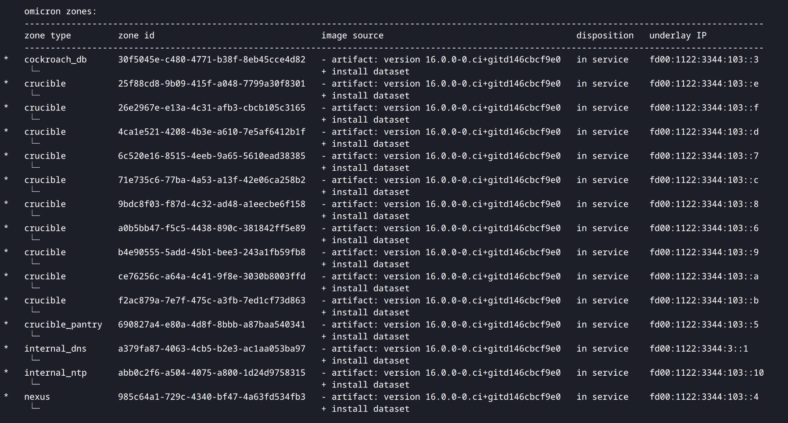

. Any pending host or Hubris artifact updates are cleared.

. The global _target release minimum generation_ field is set to the current target release generation plus one (in this example, the target release generation is currently 2):
+
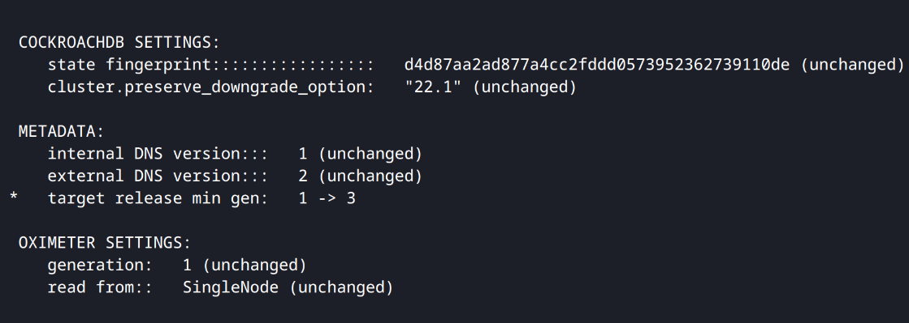

The idea behind the last two changes is to bring any Nexus-driven updates to a screeching halt, awaiting operator instruction before proceeding.

== Removing the mupdate override file

When the new blueprint is set as the target, the Reconfigurator executor will send an updated configuration to Sled Agent with instructions to:

* remove the mupdate override file if the override ID matches
* in its internal config, update zone image sources to the install dataset

Sled Agent will not restart a zone when the actual image source (after mupdate overrides are considered) is the same.

Once the new configuration has been applied, it will show up in inventory with zone image sources set to the install dataset:

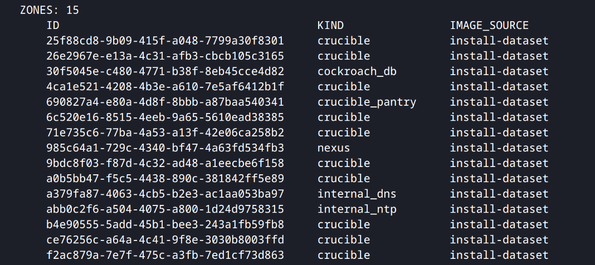

Also, the Sled Agent config reconciler will report the fact that the mupdate override was removed:

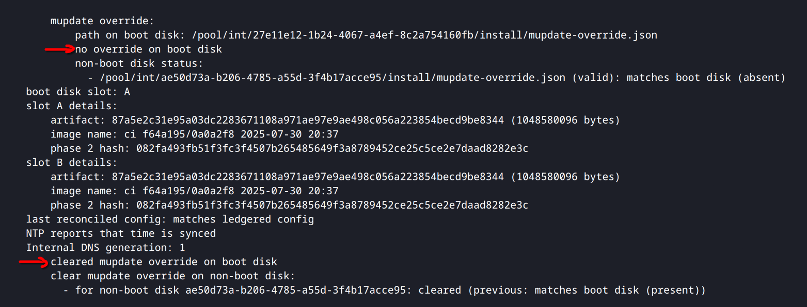

The next planning run with this inventory will generate a new blueprint where the "will remove mupdate override" field is cleared:

[source,console]
----
root@oxz_switch1:~# omdb nexus blueprints diff latest
----

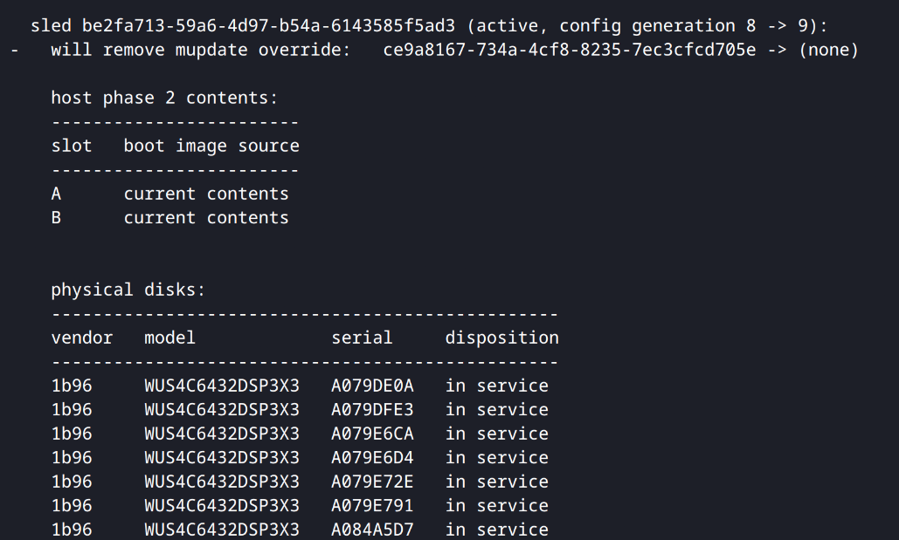

== Fully recovering

Nexus will not add or update zones until it is sure it can take over updates again. The operator instructs Nexus by:

- uploading the MUPdated-to TUF repository to Nexus
- then setting it as the target release

[source,console]
----
rain@castle $ unzip -p repo.zip repo/metadata/1.root.json | oxide api -X POST /v1/system/update/trust-roots --input -
rain@castle $ oxide system update repo upload --path repo.zip
rain@castle $ oxide experimental system update target-release update --system-version 16.0.0-0.ci+gitf64a195ff05

{
  "generation": 3,
  "release_source": {
    "type": "system_version",
    "version": "16.0.0-0.ci+gitf64a195ff05"
  },
  "time_requested": "2025-07-31T22:30:41.614644Z"
}
----

The Reconfigurator planner will generate a new blueprint with zone and host phase 2 image sources set back to `Artifact`, as long as the hashes of each image in the target release TUF repo match the ones reported by the zone manifest (which should always be the case if the MUPdated-to TUF repo is uploaded):

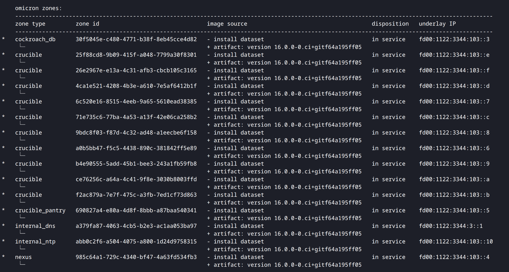

This _noop conversion_ is always performed whenever zone image hashes match, as long as a mupdate override file isn't detected on the sled. (On receiving a new configuration, Sled Agent will not restart zones if the hashes match.)

When all zone and host phase 2 images across all sleds have their image sources set to `Artifact`, the Reconfigurator planner considers the system to have fully recovered from the MUPdate. From this point onwards, zone adds and updates are allowed.

[NOTE] 
====
Zone adds (but not updates) are also allowed when either of the following conditions are met:

- no target release has ever been set for the rack (i.e. the current target release generation is the initial generation, 1)
- the `add_zones_with_mupdate_override` planner config (default false) is set to true.
====

== Appendix: Implementation rationale

This section contains detailed reasoning for implementation decisions, as an alternative to excessively long code comments.

=== Sled Agent reconciler error handling [[sa_reconciler_error_handling]]

While reconciling the mupdate override field within Sled Agent, errors during reconciliation for this field can be handled independently of the rest of the system. The argument for this is somewhat non-trivial. Here's an outline:

**If removing the mupdate override succeeds but zone shutdown or startup fails:**

(This is the most common case, and also the most interesting.)

* Before ledgering a config, we check that if the `remove_mupdate_override` field is set, all zones' image sources are set to `InstallDataset`.
* As a result, while reconciling against a configuration that initially removing the mupdate override, the reconciler will attempt to start zones exclusively from the install dataset.
* Once removing the mupdate override succeeds, the next inventory collection for the sled will contain this fact.
* Based on this, the planner will clear the `remove_mupdate_override` field in the blueprint. (In the future, clearing the `remove_mupdate_override` field will be gated on success doing no-op image source conversions, as mentioned in the next step below.)
* For sleds that don't have a `remove_mupdate_override` field set in the blueprint, including this one, the planner will perform no-op image source updates from InstallDataset to Artifact, if the hash of the zone manifest matches the one in the target release.
* As a result, the Sled Agent reconciler will receive a new configuration with zone image sources set to `Artifact` with that hash.
* Even though the update is logically a no-op from the blueprint's perspective, the reconciler will switch to starting zones from the artifact store rather than the install dataset.
* But, notably, assuming the zone was correctly written out, its hash is the same as that of the install dataset! So in effect, there's no difference between starting from the install dataset versus the artifact store.
* The planner is responsible for ensuring that no new zones are started until zone image sources are up-to-date, and all existing zones are successfully running.

**If removing the mupdate override fails due to an ID mismatch:**

(The control plane is expected to handle this case gracefully.)

* The config reconciler continues to honor the mupdate override below.
* Inventory will report the latest mupdate override ID.
* The Reconfigurator planner will update the blueprint's mupdate override field with the new value.
* The next configuration will have the new value, and reconcilation should hopefully succeed at that point.

**If removing the mupdate override fails due to an error deleting the override file from disk:**

(The control plane should handle this case reasonably as well.)

* The config reconciler continues to honor the mupdate override below.
* Inventory will continue to report the current mupdate override ID.
* The Reconfigurator planner will not update the blueprint's mupdate override field.
* The next configuration will have the new value, and reconcilation should hopefully succeed at that point.

**If removing the mupdate override fails due to an error reading the override:**

(The control plane is not designed to handle this case gracefully.)

* Omicron zones will fail to start because the zone image resolver will continue to produce an error.
* Inventory will report an error in place of the mupdate override ID.
* The Reconfigurator planner will not make any updates to the blueprint's mupdate override field until the error is resolved.
* This will be a support incident -- a corrupt mupdate override file is not a case the system is currently designed to handle.

[bibliography]
== External References

* [[[rfd345, RFD 345]]] https://rfd.shared.oxide.computer/rfd/345[RFD 345 SP-Driven Gimlet Recovery (also MUPdate)]
* [[[rfd556, RFD 556]]] https://rfd.shared.oxide.computer/rfd/556[RFD 556 Mixing MUPdate with Update]
